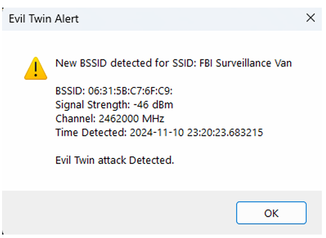
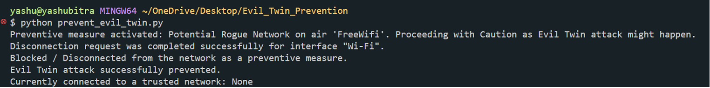

# Evil Twin Attack

## Project Overview
This project demonstrates the execution, prevention, detection, and deception techniques for mitigating Evil Twin attacks on wireless networks. An Evil Twin attack exploits vulnerabilities in Wi-Fi networks by creating rogue access points (APs) that mimic legitimate ones, tricking users into revealing sensitive information.

---

## Repository Structure
### **Core Files**
- **`Evil_Twin_Attack_Combined_Report.pdf`**: Comprehensive report detailing all phases of the project.
- **`Evil_Twin_Offense_Report.pdf`**: Documentation of the offensive attack simulation.
- **`Evil_Twin_Prevention_Report.pdf`**: Explanation of preventive measures implemented.
- **`Evil_Twin_Detection_Report.pdf`**: Analysis of detection techniques.
- **`Evil_Twin_Deception_Report.pdf`**: Strategies for deception to gather attacker intelligence.

### **Code Files**
- **`detect_evil_twin.py`**: Detects rogue access points impersonating legitimate Wi-Fi networks by monitoring BSSIDs.
- **`prevent_evil_twin.py`**: Prevents connections to untrusted or rogue networks based on SSID verification.
- **`server.py`**: Hosts a phishing captive portal to simulate data collection during an attack.
- **`index.html`**: HTML for the captive portal login page, styled for user realism.
- **`Evil_Twin.txt`**: Commands to set up, execute, and dismantle the Evil Twin attack.

### **Utility Files**
- **`creds.txt`**: Logs the credentials captured during attack simulations.
- **`LICENSE`**: Licensing information for the repository.

---

## Setup Instructions
### Prerequisites
- **Hardware**: Two USB Wi-Fi adapters with Atheros AR9271 chipset.
- **Software**: Kali Linux, Python 3.x, and required Python libraries (`pywifi`, `tkinter`).
- **Tools**: airmon-ng, aireplay-ng, airbase-ng, dnsmasq, Wireshark.

### Steps
1. Clone this repository:
    ```bash
    git clone https://github.com/your-username/Evil_Twin_Attack.git
    cd Evil_Twin_Attack
    ```

2. Clone this repository:
    ```bash
    sudo apt update
    sudo apt install aircrack-ng dnsmasq
    pip install pywifi tkinter
    ```

3. Clone this repository:
    - Set up the environment: Follow commands in Evil_Twin.txt to configure monitor mode, create a rogue AP, and host the captive portal.
    - Run the captive portal:
        ```bash
        sudo python3 custom_captive_portal/server.py
        ```
    - Monitor credentials: Captured data will be logged in creds.txt.

---

# Prevention, Detection, and Deception from Victim's Side (Windows User)

## Preventive Measures
Run `prevent_evil_twin.py` to automatically disconnect from rogue networks:

```bash
python3 Evil_Twin_Prevention/prevent_evil_twin.py
```

## Detection Mechanism
Monitor SSIDs and BSSIDs for anomalies using `detect_evil_twin.py`:

```bash
python3 Evil_Twin_Detection/detect_evil_twin.py
```

## Deception Techniques
Deploy honeypots and decoys with fake SSIDs to mislead attackers:

- Honeypot networks: Attract attackers.
- Fake captive portals: Gather intelligence on attacker methods.

---

# Visual Aids

## 1. Captive Portal Login Page
This is the login page presented to victims connecting to the rogue access point:


## 2. Successful Connection to Captive Portal
This screen confirms a victim's successful connection to the rogue AP:


## 3. Detection Mechanism in Action
Screenshot of the detection script identifying a potential Evil Twin attack:


## 4. Prevention Mechanism in Action
Screenshot of the prevention script disconnecting from untrusted networks:



---

# Future Work
- Automating attack setup for complex environments.
- Cross-platform support for prevention tools (Windows, Linux, Android, etc.).
- Enhancing IoT device security against rogue networks.
- Developing custom VPN solutions for public networks.

---

# Disclaimer
This project is for educational purposes only. Unauthorized use of these techniques is illegal. Ensure you have proper permissions before testing these tools on any network.

---
 
# License
This project is licensed under the terms of the LICENSE file provided in the repository.